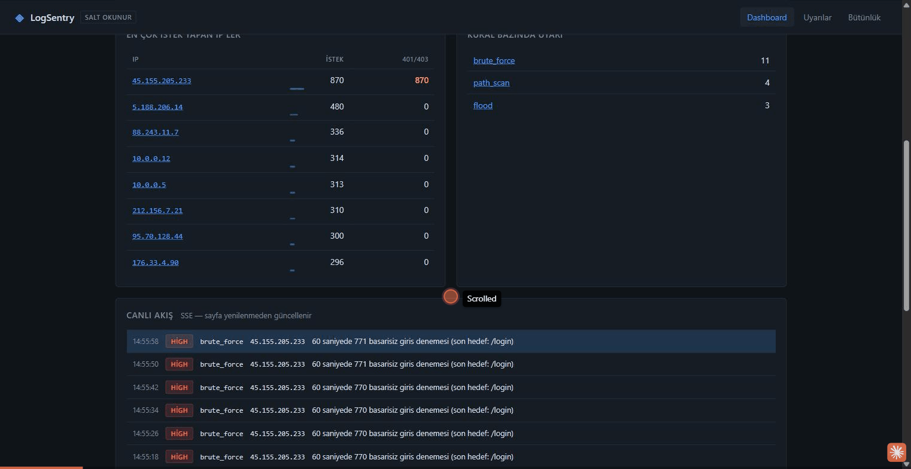

# LogSentry

[](https://github.com/AlperEnesErsu/LogSentry/actions/workflows/ci.yml)
[](https://www.ruby-lang.org)
[](LICENSE)
[](#testler)

Web sunucusu loglarını canlı izleyen, saldırı örüntülerini tespit eden ve
bildirim gönderen bir mini SIEM — **sıfırdan, adım adım, Ruby ile.**

Splunk, Wazuh veya TR7 gibi kurumsal sistemlerin kaputunun altında yatan
mantığın çalışan bir örneği. Amaç bir ürün değil, **o mantığı elle inşa
ederek öğrenmek**: akış işleme, durum yönetimi, zaman pencereleri,
daemonization, tamper-evident arşivleme.

```
access.log ─▶ TAILER ─▶ PARSER ─▶ ENGINE ─▶ NOTIFIERS ─▶ ekran / JSONL / Telegram
              canlı     metin→    kayan      hata                  │
              izleme    veri      pencere    yalıtımı              ▼
                                                          STORE + ARCHIVER
                                                          SQLite + hash zinciri
                                                                    │
                                                                    ▼
                                                              WEB (Sinatra)
                                                            dashboard + SSE
```



---

## Ne yapıyor?

Bir web sunucusu kendisine gelen her isteği `access.log`'a yazar. Tek bir satır
masumdur — biri şifreyi yanlış girmiş olabilir. Ama **aynı IP'den 1 dakikada 50
tane** böyle satır gelirse, o artık masum değildir.

> Asıl iş "kötü satırı bulmak" değil. Asıl iş şu soruyu cevaplamak:
> **"bu olay, aynı kaynaktan gelen diğer olaylarla birlikte ne anlama geliyor?"**

LogSentry log dosyasını canlı izler, her satırı çözümler, kurallardan geçirir ve
şüpheli bir örüntü görürse kanıtıyla birlikte uyarı üretir.

### Tespit edilen örüntüler

| Kural | Neyi ölçüyor | Pencere | Eşik | Önem |
|---|---|---|---|---|
| `brute_force` | aynı IP'den `401`/`403` yanıtları | 60 sn | 10 | high |
| `flood` | aynı IP'den tüm istekler | 1 sn | 100 | high |
| `path_scan` | aynı IP'den **farklı** hassas dizin sayısı | 300 sn | 3 | medium |
| `sqli` | SQL enjeksiyonu imzaları (`union select`, `information_schema`…) | 60 sn | 0 | critical |
| `xss` | XSS / komut enjeksiyonu imzaları (`<script>`, `/etc/passwd`…) | 60 sn | 0 | high |
| `scanner` | bilinen tarama araçlarının User-Agent'ı (sqlmap, nikto, nmap…) | 60 sn | 0 | medium |

İlk üçü **davranış** tabanlı: tek bir olay değil, olayların birikimi alarm
üretir. Son üçü **imza** tabanlı: eşik `0` olduğu için ilk eşleşme anında
alarm düşer — çünkü `union select` içeren tek bir istek bile kazara olmaz.

İmza kurallarında **kapsam ayrımı** var: `sqli` ve `xss` yalnızca **yol ve
referer** alanlarına bakar, `scanner` ise **user-agent**'a. Sebep: her şeyi
tarayan bir kural, user-agent'ında `union select` yazan masum bir istekte
`critical` alarm üretir — ve eşiği `0` olan bir kuralda yanlış pozitif, gece
3'te boşuna çalan telefon demektir.

`path_scan` diğerlerinden farklı: **hacim değil çeşitlilik** ölçüyor.
`/admin`'e 50 istek muhtemelen bir yer imi; 5 farklı hassas dizine 1'er istek
ise keşfetme davranışıdır — bir tarama aracının imzası. Hacim bazlı bir kural
bunu asla yakalamaz.

Eşiklerin hiçbiri koda gömülü değil, [`config/logsentry.yml`](config/logsentry.yml)
içinde. Kurumsal sistemlerde kural eşikleri her zaman kodun dışındadır.

---

## Hızlı başlangıç

### Gereksinimler

- **Ruby 3.0+** (3.4 önerilir)
- Adım 6–7 için: `gem install sqlite3 sinatra puma`
- Daemon modu için **Linux/WSL** (`Process.daemon` Windows'ta yok)

Adım 1–5 arası çekirdek **sıfır dış bağımlılıkla** çalışır — yalnızca Ruby'nin
kendi kütüphaneleri.

### 1. Test verisi üret ve boru hattını çalıştır

```bash
ruby tools/demo_env.rb
```

24 saate yayılmış gerçekçi bir log üretir (içine bilinçli olarak üç saldırgan
serpiştirilmiş), boru hattını bir kez çalıştırıp veritabanını doldurur ve
mühürlü arşivler oluşturur.

### 2. Web arayüzünü aç

```bash
ruby bin/logsentry-web
```

Sonra tarayıcıda `http://127.0.0.1:4567`

### 3. Canlı izlemeyi gör (iki terminal)

Saldırı trafiği üret:

```bash
ruby tools/live_writer.rb --attack brute --rps 14
```

İzleyiciyi başlat:

```bash
ruby bin/logsentry --config config/demo.yml
```

Uyarılar hem terminale hem `logs/alerts.jsonl`'a düşer, web arayüzündeki canlı
akışta sayfa yenilenmeden görünür.

---

### Docker ile

Ruby kurmak istemiyorsan:

```bash
docker compose up --build
```

Tarayıcıda `http://localhost:4567`. Sahte trafik de isteniyorsa:

```bash
docker compose --profile demo up --build
```

Üç servis mimarideki üç process'in birebir karşılığı: `logsentry` (izleyici),
`logsentry-web` (arayüz), `traffic` (sahte trafik, sadece `demo` profilinde).
Port `127.0.0.1:4567` olarak bağlanıyor — yani panel dışarıya açılmıyor.

---

## Komutlar

### İzleyici servis

```bash
bin/logsentry                      # ön planda (Ctrl-C ile dur)
bin/logsentry --daemon             # arka plana çekil (Linux/WSL)
bin/logsentry --stop               # SIGTERM + kapandığını doğrula
bin/logsentry --reload             # SIGHUP — yapılandırmayı yenile
bin/logsentry --status             # çalışıyor mu, PID kaç
bin/logsentry --check              # yapılandırmayı doğrula ve çık
bin/logsentry --from-begin --once  # geçmişi bir kez tara ve çık
```

`--check` üretimde altın değerinde: yapılandırmayı **değiştirdikten sonra**,
servisi yeniden başlatmadan **önce** doğrularsın.

### Arşivleme ve bakım (cron)

```bash
bin/logsentry-archive --verify     # hash zinciri bütünlük denetimi
bin/logsentry-archive --stats      # arşiv durumu
bin/logsentry-archive --roll       # canlı logu döndür + arşivle
bin/logsentry-archive --prune      # saklama süresi geçenleri sil
bin/logsentry-archive --prune-db   # sıcak katmanı temizle
bin/logsentry-archive --all        # doğrula + döndür + temizle
bin/logsentry-archive -n --prune   # deneme modu: neyin silineceğini göster
```

```
15 3 * * * cd /opt/logsentry && bin/logsentry-archive --all >> logs/archive.log 2>&1
```

`--verify` bütünlük bozulmuşsa **çıkış kodu 2** döndürür — cron haber alır.

### Web arayüzü

```bash
bin/logsentry-web                  # http://127.0.0.1:4567
bin/logsentry-web --port 8080
```

| Rota | Ne gösterir |
|---|---|
| `/` | Dashboard: 24 saatlik grafik, top IP'ler, canlı akış |
| `/alerts` | Filtrelenebilir uyarı listesi (kural / önem / IP) |
| `/alerts/:id` | **Kanıt sayfası** — neden alarm verildi + ham log satırları + bağlam |
| `/integrity` | Arşiv hash zinciri doğrulaması |
| `/stream` | SSE veri ucu |
| `/health` | JSON sağlık kontrolü |

---

## Mimari

Sistem tek bir program değil, **üç bağımsız process**:

```
   bin/logsentry (daemon)          bin/logsentry-web (Sinatra)
   access.log'u izler              tarayıcıya hizmet eder
   kural işletir                   :4567
          │ YAZAR                            │ OKUR
          ▼                                  ▼
   ┌──────────────────────────────────────────────┐
   │   db/logsentry.db   +   logs/alerts.jsonl    │
   └──────────────────────────────────────────────┘
                        ▲
                        │ ARŞİVLER / TEMİZLER (cron)
              bin/logsentry-archive
```

**Neden ayrı?** Web arayüzü çökerse **izleme durmamalı**. Güvenlik izlemesini bir
web sunucusunun kaderine bağlamak kötü mühendisliktir — Prometheus/Grafana
ayrımının aynısı.

### Üç sözleşme

Sistemi ayakta tutan şey bu üç cümle:

| Bileşen | Girdi | Çıktı |
|---|---|---|
| **Parser** | metin satırı | `Entry` **veya** `nil` — ama asla çökmez |
| **Rule** | `Entry` | `Alert` **veya** `nil` |
| **Notifier** | `Alert` | — gönderemezse sistemi durdurmaz |

Bütün kurallar aynı sözleşmeye uyduğu için motorun tüm mantığı tek satır:

```ruby
@rules.filter_map { |rule| rule.call(entry) }
```

20 kural daha eklesen bu satır aynen kalır.

### İki katmanlı depolama

| | **SICAK** — `db/logsentry.db` | **SOĞUK** — `archive/*.log.gz` |
|---|---|---|
| Ne | ayrıştırılmış veri (SQLite) | ham log, dokunulmamış |
| Süre | 90 gün | yasal süre (varsayılan 730 gün) |
| Amaç | **hızlı sorgu** | **kanıt** |
| Sorgulanabilir | evet, milisaniyeler | hayır, ama bozulamaz |

Ham logu asla veritabanına ezdirmiyoruz — mahkemede *"biz bunu ayrıştırdık,
işledik, kendi şemamıza soktuk"* demek istemezsin.

Tam mimari, tasarım gerekçeleri ve Ruby'yi hiç bilmeyenler için kavram sözlüğü:
**[ARCHITECTURE.md](ARCHITECTURE.md)**

---

## Bütünlük: hash zinciri

Arşivlenen her dosya mühürlenir ve mühür kendinden öncekini içerir:

```
chain[n] = SHA256( chain[n-1] + sha256[n] )
```

Ortadaki tek bir dosyayı değiştirmek isteyen birinin **sonraki tüm** mühürleri de
yeniden hesaplaması gerekir. İki kurcalama senaryosu test edilmiş durumda:

1. Saldırgan **geçerli** bir gzip üretip içeriğinden kendi satırlarını siler →
   ham içerik özeti yakalar
2. Saldırgan manifest'teki özeti de günceller → **zincir yakalar**

Silme işlemi de bir olaydır ve manifest'e kaydedilir: *"bu log nerede?"*
sorusunun cevabı "bilmiyorum" değil, *"şu tarihte saklama süresi dolduğu için
silindi"* olmalı.

> Bu mekanizma blok zincirinin de temelinde yatan fikirdir. Kurumsal log
> ürünlerinin "değiştirilemez kayıt" (tamper-evident) iddiası bunun üzerine
> kuruludur. Tam hukuki geçerlilik için yetkili bir zaman damgası
> sağlayıcısından (TSA) imza gerekir — mekanizma aynı, imzalayan taraf farklı.

---

## Saklama süresi ve mevzuat

Türkiye'de 5651 sayılı Kanun kapsamındaysan trafik kayıtlarını belirli bir süre
saklamak zorundasın. Ama süre **iki yönlü** bir kısıttır:

```
     │◀── ihlal ──▶│◀──── uygun aralık ────▶│◀── ihlal ──▶│
─────┼─────────────┼────────────────────────┼─────────────▶
     0        yasal alt sınır          amaç sonu       süresiz
              (5651: sakla)            (KVKK: sil)
```

**IP adresi KVKK'ya göre kişisel veridir** — "garanti olsun diye süresiz
tutalım" yaklaşımı da ihlaldir. Politika tek bir yerde:
`archive.retention_days`.

> **Bu bir hukuki görüş değildir.** Kendi kategorin (erişim sağlayıcı / yer
> sağlayıcı / ticari toplu kullanım sağlayıcı) ve kesin süre için mevzuatı ve
> hukuk tarafını teyit et. Buradaki tasarım, "böyle bir yükümlülük varsa mimari
> nasıl olmalı" sorusunun cevabıdır.

---

## Güvenlik notları

Bir izleme aracının kendisi de hedeftir. Alınan önlemler:

- **Panel salt okunur.** GET/HEAD dışındaki her şey 405. Yazma yetkisi olmayan
  panel, ele geçirilse bile hasar veremez.
- **Sadece localhost.** `bind: 127.0.0.1`. Dışa açılırsa açık uyarı basılır.
  (Kimlik doğrulama kapsam dışı — dışa açacaksan Nginx + TLS + auth arkasından.)
- **XSS savunması.** Log verisinin çoğunu **saldırgan yazıyor**;
  `GET /<script>...` isteyen biri panele hiç erişmeden orada kod
  çalıştırabilirdi. Her alan escape ediliyor, tarayıcı tarafında `innerHTML`
  yerine `textContent`. 6 XSS testi var.
- **Parametreli SQL.** Filtre değerleri SQL metnine hiç girmiyor. (SQL
  enjeksiyonu arayan bir aracın kendisinin açık olması, işin ironisi olurdu.)
- **Sırlar ortam değişkeninde.** Webhook adresi config'e yazılmaz, yalnızca onu
  tutan değişkenin adı yazılır — yapılandırma dosyaları git'e girer ve **git
  geçmişi silinmez**. Token loglarda da maskelenir.
- **Yığın izi sızdırılmaz.** Hata ayrıntısı sunucu loguna, kullanıcıya sade mesaj.
- **En az yetki.** `deploy/logsentry.service` root olmayan bir kullanıcı,
  `ProtectSystem=strict`, `MemoryMax=256M` ile çalışır.
- **Sınırlı bellek.** Kayan pencerelerde `MAX_KEYS` / `MAX_EVENTS_PER_KEY`
  tavanları var: *DDoS'u tespit etmek için yazdığın kod, DDoS'un kendisi
  tarafından RAM tüketilerek öldürülemez.*

---

## Dağıtım (systemd)

```bash
sudo cp deploy/logsentry.service /etc/systemd/system/
sudo systemctl daemon-reload
sudo systemctl enable --now logsentry
journalctl -u logsentry -f
```

`Process.daemon`'u öğrenmek **doğru**, kullanmak genelde **gereksiz**. Birim
dosyası `Type=simple` ile programı ön planda çalıştırır; systemd arka planda
tutar, çökerse yeniden başlatır (`Restart=always`), logları journald'a yazar ve
kaynak/güvenlik sınırlarını çekirdek seviyesinde uygular. Kendi kendine
daemonlaşan bir process'te bunların hiçbirinin karşılığı yoktur.

---

## Proje yapısı

```
lib/log_sentry/
  entry.rb          bir log satırının veri modeli (Struct)
  parser.rb         regex ile metin → veri
  tailer.rb         tail -f mantığı, rotasyon, checkpoint
  alert.rb          bir uyarının veri modeli
  engine.rb         kural motoru
  rules/            base (kayan pencere) + 3 kural
  notifiers/        base (hata yalıtımı) + console/file/store/webhook
  daemon.rb         Process.daemon, PID dosyası
  store.rb          SQLite: WAL, toplu yazma, parametreli sorgu
  archiver.rb       gzip + SHA-256 hash zinciri + saklama süresi
  web/              Sinatra uygulaması, ERB şablonları, CSS/JS
lib/log_sentry.rb   Supervisor — boru hattını birleştirir

bin/                logsentry · logsentry-web · logsentry-archive
config/             logsentry.yml (eşikler, saklama, web) · demo.yml
deploy/             logsentry.service
test/               6 paket, 181 test
tools/              log_generator · live_writer · watch · demo_env
step1..6_*.rb       adım adım öğrenme/gösterim dosyaları
reports/            her adımın raporu
```

**~9.100 satır Ruby**, bunun ~5.200'ü kütüphane, ~2.900'ü test.
Kütüphane kodunun **%42'si yorum** — bu bir öğrenme projesi, her kararın
gerekçesi kodun içinde yazılı.

---

## Testler

```bash
ruby test/parser_test.rb
ruby test/tailer_test.rb
ruby test/engine_test.rb
ruby test/daemon_test.rb
ruby test/store_test.rb
ruby test/web_test.rb
```

| Paket | Test | Doğrulama |
|---|---|---|
| `parser_test.rb` | 21 | 64 |
| `tailer_test.rb` | 15 | 24 (Win, 3 atlama) / 32 (WSL) |
| `engine_test.rb` | 41 | 229 |
| `daemon_test.rb` | 29 | 86 |
| `store_test.rb` | 47 | 136 |
| `web_test.rb` | 33 | 106 |
| **Toplam** | **190** | **0 hata** (Windows + WSL Ubuntu 22.04 + CI: 2 OS × 3 Ruby) |

Yalnızca `minitest` (Ruby ile birlikte gelir). Windows'ta atlanan 3 test, açık
dosyanın taşınamamasından — `skip` ile atlanıyor, sahte geçmiyor.

Testler kasten **hızlı ve saf**: zaman uydurulmuş (`sleep 61` yok), veritabanı
`:memory:`, gerçek HTTP isteği ve gerçek daemon yok. 190 test saniyeler içinde
koşuyor.

Her push'ta GitHub Actions üzerinde **Ubuntu ve Windows × Ruby 3.2 / 3.3 / 3.4**
matrisinde yeniden koşuyor — yani kod, temiz bir makinede sıfırdan kurulumla da
çalışıyor.

---

## Ölçümler

| Ölçüm | Sonuç |
|---|---|
| Ayrıştırma hızı | ~70.000 satır/saniye |
| Uçtan uca (parser + motor) | ~84.000 kayıt/saniye |
| `File.foreach` bellek (39 MB dosya) | 187 bayt |
| SQLite toplu yazma kazancı | 17.000 → 201.000 kayıt/sn (11,6 kat) |
| gzip arşiv tasarrufu | %96,1 |
| Dashboard sorguları | 0,02 – 0,73 ms |
| Soğutmanın etkisi | 1097 → 24 uyarı (54,8 kat azalma) |

Son satır önemli: ikisi de teknik olarak doğru, ama soğutmasız hali
**kullanılamaz**. Gerçek hayatta SIEM projelerini bitiren şey yanlış tespit
değil, **bildirim yorgunluğudur** — insan 200. bildirimden sonra hepsini
görmezden gelmeye başlar.

---

## Nasıl inşa edildi

Proje 7 adımda, her adımın sonunda çalışan ve test edilmiş bir sistem olacak
şekilde geliştirildi. Her adımın kendi raporu var — ne yapıldığı, hangi kararın
neden alındığı, hangi hataların bulunduğu:

| Adım | Konu | Rapor |
|---|---|---|
| 1 | Sahte log ortamı, sabit bellekli okuma | [ADIM-1](reports/ADIM-1-dosya-okuma.md) |
| 2 | Regex ile ayrıştırma, `Entry` modeli | [ADIM-2](reports/ADIM-2-regex-ayristirma.md) |
| 3 | `tail -f` mantığı, rotasyon, checkpoint | [ADIM-3](reports/ADIM-3-canli-izleme.md) |
| 4 | Kayan pencere, kural motoru, soğutma | [ADIM-4](reports/ADIM-4-kural-motoru.md) |
| 5 | Daemon, sinyaller, webhook, systemd | [ADIM-5](reports/ADIM-5-daemon-bildirim.md) |
| 6 | SQLite + arşivleme + hash zinciri | [ADIM-6](reports/ADIM-6-depolama-arsivleme.md) |
| 7 | Sinatra web arayüzü + SSE | [ADIM-7](reports/ADIM-7-web-arayuzu.md) |

Genel bakış ve bulunan 12 gerçek kusurun listesi:
**[reports/README.md](reports/README.md)**

### Tekrar eden beş ilke

1. **Bir daemon içinde sınırsız büyüyen hiçbir yapıya yer yoktur.** `File.read`
   → hata örnekleri → kısmi satır tamponu → kayan pencere tavanları → webhook
   hız sınırı → tarayıcıdaki DOM listesi.
2. **Sessiz yanlış, çökmekten tehlikelidir.** Araç çalışıyor görünür ama hiçbir
   şey görmez. Bu yüzden: ayrıştırma başarı oranı, düşürülen anahtar sayacı,
   `SIGUSR1` durum raporu.
3. **Yapılandırma hatası başlangıçta patlamalı.** Gece 3'te alarm üretmesi
   gereken bir servis, eksik ayarla sessizce başlamamalı.
4. **Kanıt göstermeyen alarm gürültüdür.** Her uyarı, kendisini doğuran ham log
   satırlarını taşır.
5. **Verinin çoğunu saldırgan yazıyor.** Log satırı saldırgan-kontrollü bir
   girdidir — parser çökmez, geçersiz baytlar temizlenir, panel escape eder,
   SQL parametreli olur.

---

## Bilinçli olarak kapsam dışı

Gerçek bir SIEM'de olan ama burada olmayan şeyler — bunları bilmek, yaptığın
şeyin sınırlarını bilmek demektir:

- **Dağıtık toplama.** Tek makinedeki tek dosya izleniyor, 500 sunucu değil.
- **Korelasyon.** Farklı kaynaklar (firewall + web + DNS) ilişkilendirilmiyor.
  Kurumsal SIEM'in asıl gücü buradadır.
- **Kimlik doğrulama.** Panel localhost'ta, kullanıcı girişi yok.
- **Yetkili zaman damgası (TSA).** Kendi hash zincirimizle mühürlüyoruz.
- **Otomatik müdahale.** Saldırganın IP'si firewall'a eklenmiyor. Bu, eklenmesi
  en kolay ve en tehlikeli özelliktir — yanlış pozitif bir alarmda kendi
  kullanıcılarını engellersin.
- **Dağıtık DDoS tespiti.** `flood` kuralı IP başına bakar; gerçek bir DDoS
  binlerce IP'den gelir ve tek tek hiçbiri eşiği aşmaz. "DDoS tespit ediyorum"
  demek, yapmadığın bir şeyi iddia etmek olur.

Ve dürüst bir not: üretimde bu web arayüzünü yazmazsın — `alerts.jsonl`'ı
Loki/Elasticsearch'e gönderip Grafana kullanırsın. Adım 7'nin değeri üretim
değeri değil, **kaputun altını görmek**.

---

## Öğrenilen DevOps becerileri

| Konu | Gerçek hayatta nerede |
|---|---|
| Akış halinde sabit bellekli okuma | Filebeat/Fluentd/Logstash okuma katmanı |
| Regex ile ayrıştırma | grok kalıpları, log şeması tasarımı |
| Rotasyon ve offset yönetimi | `logrotate` ile yaşamak, Promtail |
| Durum + zaman pencereli kural | Prometheus alert rule'ları, rate limiting |
| Daemon, sinyaller, nazik kapanma | systemd servisi yazmak |
| Sır yönetimi, bildirim yorgunluğu | Alertmanager, on-call zinciri |
| SQLite ayarları (WAL, batch, indeks) | üretimde gömülü veritabanı |
| Tamper-evident arşivleme | log uyumluluğu, adli hazırlık |
| SSE, thread havuzu, kaynak sızıntısı | canlı gösterge panelleri |

Özellikle Adım 3 ve 5, *"kodum çalışıyor"* ile *"servisim ayakta"* arasındaki
farkı öğrettiği için DevOps'un tam merkezinde duruyor.

---

## Not

Bu bir öğrenme projesidir; üretim ortamına olduğu gibi konulmak üzere
tasarlanmadı. Gerçek bir kurulumda kimlik doğrulama, dağıtık toplama ve yetkili
zaman damgası eklenmesi gerekir.
